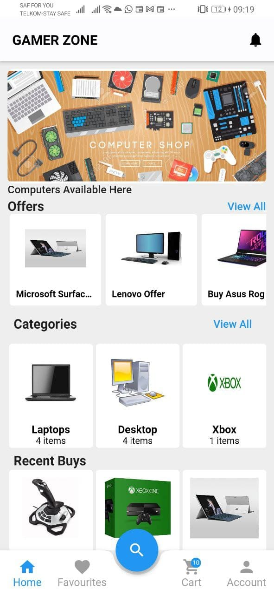
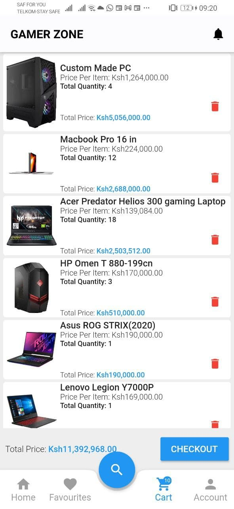

## General Information

The project is designed to streamline the order placement process for salespeople, allowing them to efficiently place orders with distributors on behalf of their retailers. By solving the challenges of sales force automation and supply chain management, this system enhances communication and coordination between retailers, sales teams, and distributors. It ensures that sales representatives can place accurate, timely orders while keeping track of inventory and product availability in real time. Initiated in 2023, the project's primary goal is to create a seamless workflow for sales teams, reduce manual errors, and optimize the supply chain from distributors to retailers. This automation improves operational efficiency, ensuring that retailers receive their stock faster, sales teams operate more efficiently, and distributors have better visibility of demand across their networks. Ultimately, it empowers businesses to maintain a well-oiled supply chain, maximizing productivity and sales opportunities.
## Technologies Used

- Flutter - version 2.2.3

## Features

List the ready features here:

- Retailer Login
- Salesman Login
- Salesman Offline

## Screenshots

## Setup

upgrade to flutter 2, run flutter upgrade
run flutter pub get
run flutter run

## Usage

How does one go about using it?
Provide various use cases and code examples here.

## Project Status

Project is: _in progress.

